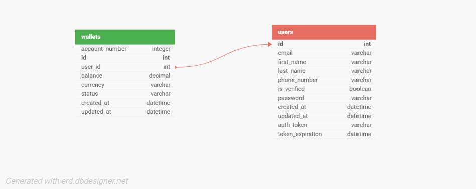

# Demo Credit - Lendsqr Wallet Service

## Overview
Demo Credit is an MVP wallet service designed for Lendsqr's mobile lending platform.  
The service provides secure wallet functionality that enables borrowers to receive loans and make repayments through a robust financial transaction system.

## Features
- User Account Creation with Karma blacklist verification  
- Account Funding with transaction safety  
- Peer-to-Peer Transfers between user accounts  
- Fund Withdrawals with balance validation  
- JWT Authentication system  
- Comprehensive Unit Testing (95%+ coverage)  

## Tech Stack
- **Runtime:** Node.js (LTS)  
- **Language:** TypeScript  
- **Framework:** Express.js  
- **Database:** MySQL  
- **ORM:** Knex.js  
- **Authentication:** JSON Web Tokens (JWT)  
- **Password Hashing:** bcryptjs  
- **Testing:** Jest  
- **API Integration:** Lendsqr Adjutor Karma API  

---

## Database Design

### Entity Relationship Diagram



```mermaid
erDiagram
    USERS {
        int id PK
        string email UK
        string first_name
        string last_name
        string phone_number UK
        string password
        string auth_token
        datetime token_expiration
        datetime created_at
        datetime updated_at
    }
    
    WALLETS {
        int id PK
        int user_id FK
        int account_number UK
        decimal balance
        string currency
        enum status
        datetime created_at
        datetime updated_at
    }
    
    USERS ||--|| WALLETS : owns
